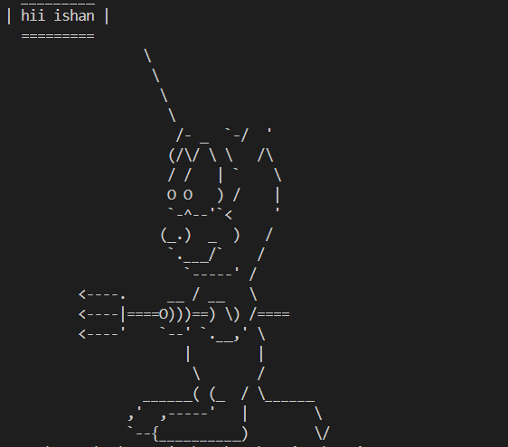

<h1 align="center">Python Project</h1>

<ul>
<li>  </li>
<li> [![Day2 ] (What is break, continue and pass in Python?)](https://github.com/ishanwalia7579/Python--project/blob/main/Day%202.py)</li>
<li>
  </li>  
<li> </li>  
<li> </li>  
<li> </li>  
<li> </li>
  
<li> </li>
  
<li> </li>
